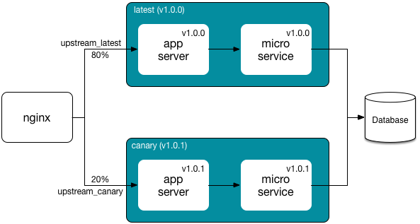

# nginx-canary

nginx with canary release support.

**Canary release** is a strategy to reduce the risk of releasing a new version to production. The new version is offered to a reduced subset of production users so that it is possible to get feedback from real users. If the version is finally considered wrong, it is possible to roll back or fix the problems with the advantage of affecting just a small percentage of the users. On the other hand, if the version is considered stable, it can be promoted so that all users can get benefit from it.

The following picture presents a canary release case with 2 deployment groups: **canary** and **latest**. Only a 20% of users are assigned to the canary deployment group, with the latest version 1.0.1. The other 80% are linked to the latest deployment group, with version 1.0.0. 



Note that some components (e.g. database) can be shared by both deployment groups.

## Features

- nginx with **canary release support** (logic implemented with lua scripts).
- **HTTP cookies** let users track a specific deployment group and/or software version. When the deployment group changes the software version, nginx tries to select another deployment group with the same version so that the user maintains the same experience as long as possible; if not available, then the user is assigned a new deployment group and software version. 
- A user can **force a deployment group** either with a query parameter or an HTTP header.
- There are 2 **policies** to assign a deployment group to a user:
  - The **random** policy (default one) chooses randomly a deployment group according to the partition weights unless the user is already assigned to a valid deployment group (e.g. with a cookie).
  - The **header_authorization** policy applies a mathematical operation on the Authorization header value to select a deployment group according to the partition weights; it aims that each client always targets the same deployment group. This policy can be useful for APIs where cookies do not make sense. 

## Create the docker image

```sh
docker build -t nginx-canary .
```

## Run the docker image

```sh
docker run --name nginx-canary \
           --restart always \
           -p "0.0.0.0:8080:8080" \
           -v "/var/log/nginx:/var/log/nginx" \
           -d nginx-canary
```

**NOTE**: See [Set up a virtual server](#set-up-a-virtual-server) to customize the default virtual server configuration.

You might configure the canary release properties as environment variables when launching the container:

```sh
docker run --name nginx-canary \
           --restart always \
           -p "0.0.0.0:8080:8080" \
           -v "/var/log/nginx:/var/log/nginx" \
           -e "DOMAIN=your-site.com" \
           -e "PARTITION_CANARY=20" \
           -e "PARTITION_LATEST=80" \
           -e "VERSION_CANARY=1.0.0" \
           -e "VERSION_LATEST=1.0.0" \
           -d nginx-canary
```

## Configure canary release

The script `/usr/bin/nginx-canary.sh` enables to modify the default configuration for canary release. It aims to update the configuration files and then reload nginx to take the changes.

The following example sets up a domain `your-site.com`, required for cookies, and configures the versions and distributions weights for two deployment groups: `canary` and `latest`. 

```sh
docker exec -t nginx-canary nginx-canary.sh \
            --domain=your-site.com \
            --partition-canary=20 \
            --partition-latest=80 \
            --version-canary=1.0.0 \
            --version-latest=1.0.0
```

This configuration is stored in the docker volume `/etc/nginx/canary` with a double purpose:

- the configuration is persistent after docker restarts, upgrades or configuration changes. The script `/usr/bin/nginx-canary.sh` only overrides the configuration parameters specified explicitly, maintaining the values for the rest of configuration parameters (with the default ones or the ones previously configured).
- the volume can be mounted in the host when it is prefered to work with files instead of using a configuration script.

Once the partitions are initialized, when a newer version is deployed in canary (e.g. 1.0.1), nginx can be reconfigured with the same command:

```sh
docker exec -t nginx-canary nginx-canary.sh \
            --version-canary=1.0.1
```
The canary configuration properties are:

| PROPERTY | ENVIRONMENT VARIABLE | TYPE | DEFAULT VALUE | DESCRIPTION |
| -------- | -------------------- | ---- | ------------- | ----------- |
| domain | DOMAIN | string | localhost | Server domain. It is used for the cookies. |
| cookies | COOKIES | boolean | true | If true, the deployment group and version allocated to a user are stored in cookies. It is recommended for web portals. However, it does not make sense for REST/SOAP APIs because API clients do not usually maintain cookies. | 
| policy | POLICY | string | random | Two policies are implemented: **random** where the partition is randomly selected according to the partition weights configured for the deployment groups, and **header_authorization** where the partition is calculated from a mathematical operation with the Authorization header so that the same credentials target the same deployment group. |
| routing-header | ROUTING_HEADER | string | Deployment-Group | Name of the HTTP header to force the selection of a specific deployment group. Set this property to empty to forbid this choice. |
| routing-query-param | ROUTING_QUERY_PARAM | string | deployment_group | Name of the query parameter to force the selection of a specific deployment group. Set this property to empty to forbid this choice. |
| partition-* | PARTITION-* | integer | - | Identifies the partition weight for this deployment group |
| version-* | VERSION-* | string | - | Identifies the version deployed in the deployment group |

**NOTE**: Partition and version properties require the name of the deployment group. For example, to configure a version for the `canary` deployment group, the property name would be `version-canary`.

## Testing canary release

The default docker image configures a sample virtual server, exposed at port 8080, to test the canary release feature.

This section considers that configuration applied the previous section instructions to set up canary and latest with version 1.0.1 and 1.0.0 respectively.

Testing the following command: `curl -v http://localhost:8080`, it distributes the requests (without cookies) among canary (20% of requests) and latest (80% of requests) deployment groups. The response contains two cookies that save the deployment group and the version allocated to the user so that next requests target the same deployment group and version. For example, if the user is allocated to the latest deployment group, the cookies are the following ones:

```
Set-Cookie: deployment_group=latest;path=/;HttpOnly;domain=.your-site.com;Expires=Mon, 21-Nov-17 09:35:39 GMT
Set-Cookie: deployment_version=1.0.0;path=/;HttpOnly;domain=.your-site.com;Expires=Mon, 21-Nov-17 09:35:39 GMT
```

It is possible to force a deployment group using the query parameter `deployment_group` (see `routing-query-param` property): `curl -v http://localhost:8080?deployment_group=canary`

## Set up a virtual server

The default nginx virtual server is only for testing purposes. It must be overriden by mounting a data volume with the nginx configuration for the virtual server in directory `/etc/nginx/conf.d`. There are several choices that include to [mount a host directory](https://docs.docker.com/engine/tutorials/dockervolumes/#/mount-a-host-directory-as-a-data-volume) or to [mount a data volume container](https://docs.docker.com/engine/tutorials/dockervolumes/#/creating-and-mounting-a-data-volume-container).

The virtual server is standar nginx configuration. This section only focuses on the canary release specifics by explaining the default settings.

The file `/etc/nginx/conf.d/server_default.conf` configures a HTTP server listening at port 8080. The canary release logic is applied to all the requests, setting the nginx variable `user_upstream` that stores the deployment group assigned to the request. Finally, the request is forwarded to an upstream related to the selected deployment group. For example, if the canary release logic chooses the `canary` deployment group, then `user_upstream` is set to canary, and the request is forwarded to the upstream `http://backend-canary`.  

```
server {
   listen 8080;
   server_name localhost;
   location / {
       set $user_upstream "";
       rewrite_by_lua_file /etc/nginx/lua/router.lua;
       proxy_pass http://backend-${user_upstream};
   }
}
```

The following example runs the docker container with the virtual server configuration mounted with a host directory:

```sh
docker rm -f nginx-canary

docker run --name nginx-canary \
           --restart always \
           -p "0.0.0.0:8080:8080" \
           -v "/etc/nginx/conf.d:/etc/nginx/conf.d" \
           -v "/var/log/nginx:/var/log/nginx" \
           -d nginx-canary
```

## License

Copyright 2016 [Telefónica Investigación y Desarrollo, S.A.U](http://www.tid.es)

Licensed under the Apache License, Version 2.0 (the "License"); you may not use this file except in compliance with the License. You may obtain a copy of the License at

http://www.apache.org/licenses/LICENSE-2.0

Unless required by applicable law or agreed to in writing, software distributed under the License is distributed on an "AS IS" BASIS, WITHOUT WARRANTIES OR CONDITIONS OF ANY KIND, either express or implied. See the License for the specific language governing permissions and limitations under the License.